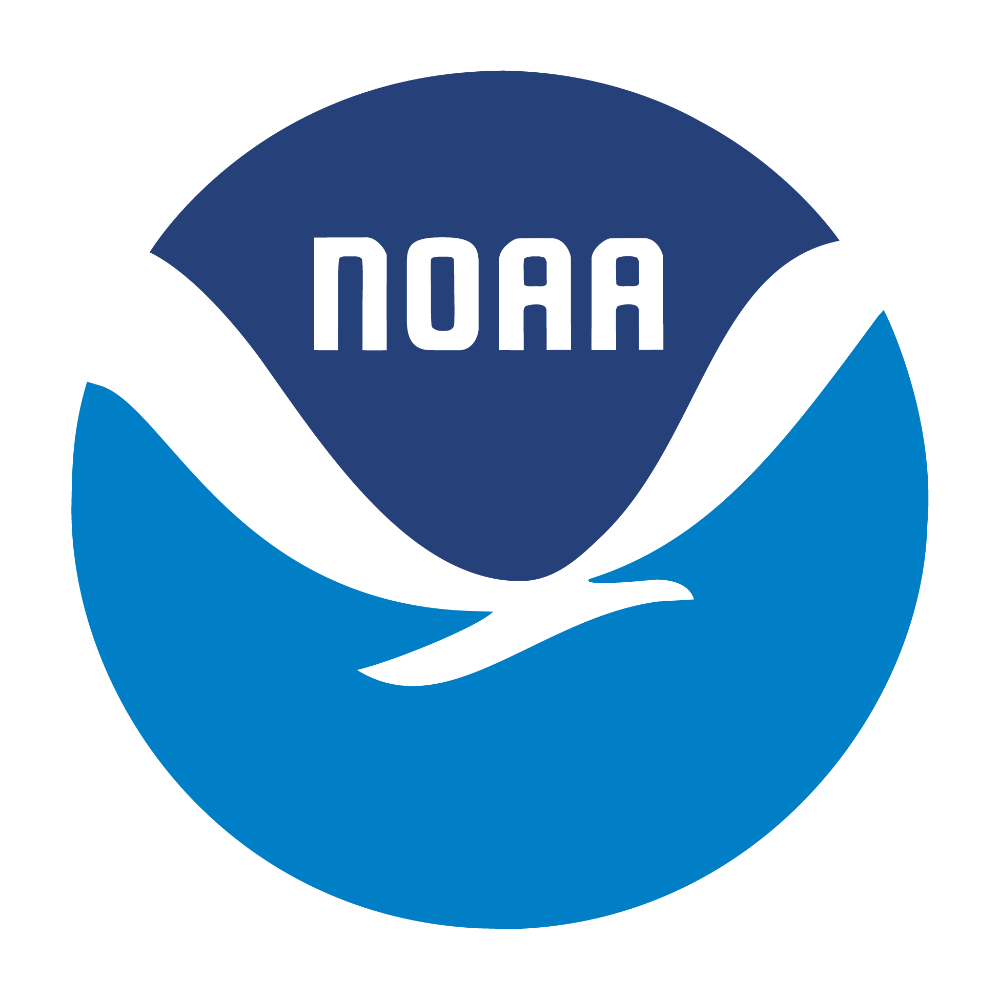

<p align="center">
  <a href="https://nauticalcharts.noaa.gov/learn/nbs.html"></a>
  <br>
  <strong>National Bathymetric Source</strong>
</p>

---

<p align="center">
    <a href="#background">Background</a> •
    <a href="#requirements">Requirements</a> •
    <a href="#installation">Installation</a> •
    <a href="#quickstart">Quickstart</a> •
    <a href="#cli">CLI</a> •
    <a href="#data-sources">Data Sources</a> •
    <a href="#authors">Contact</a>
</p>

## Overview

This package simplifies getting NOAA bathymetric data in your area of interest.

For most use cases, the quickstart below is all you need.

For more detailed guides, API reference, and troubleshooting, see the [full documentation](https://noaa-ocs-hydrography.github.io/noaabathymetry/).

## Background

NOAA's [National Bathymetric Source](https://nauticalcharts.noaa.gov/learn/nbs.html) builds and publishes the best available high-resolution bathymetric data of U.S. waters. The program's workflow is designed for continuous throughput, ensuring the best bathymetric data is always available to professionals and the public. This data provides depth measurements nationwide, along with vertical uncertainty estimates and information on the originating survey source. It is available in multiple formats (GeoTIFF compilations like [BlueTopo](https://www.nauticalcharts.noaa.gov/data/bluetopo.html) and Modeling, BAG, and IHO S-102) hosted on a public S3 bucket.

This package simplifies downloading bathymetric data from NOAA and optionally assembling them into per-UTM-zone GDAL Virtual Rasters for use in GIS applications. It supports six data sources (BlueTopo, Modeling, BAG, S-102 v2.1/v2.2/v3.0).

## Requirements

This codebase is written for Python 3 and relies on the following python
packages:

- gdal / ogr
- boto3
- tqdm

## Installation

Install conda (If you have not already): [conda installation](https://docs.conda.io/projects/conda/en/latest/user-guide/install/)

In the command line, create an environment with the required packages:

```
conda create -n noaabathymetry_env -c conda-forge 'gdal>=3.9'
```

```
conda activate noaabathymetry_env
```

```
pip install noaabathymetry
```

## Quickstart

After installation, you have access to a Python API and two matching CLI commands: `fetch_tiles` for downloading tiles and `build_vrt` for assembling them into VRTs.

See the Python API and CLI sections below to get started. You can also use the [Quickstart Helper](https://noaa-ocs-hydrography.github.io/noaabathymetry/quickstart-helper.html) to draw your area of interest on a map and generate usage examples.

## Python API

Define your area of interest using any of the geometry formats listed below, then you can use the following in a Python shell or script.

To download files in your area of interest (default data source is [BlueTopo](https://www.nauticalcharts.noaa.gov/data/bluetopo.html)):

```python
from nbs.noaabathymetry import fetch_tiles
result = fetch_tiles('/path/to/project', geometry='area_of_interest.gpkg')
```

To build a GDAL VRT of the downloaded files:

```python
from nbs.noaabathymetry import build_vrt 
result = build_vrt('/path/to/project')
```

## CLI

You can also use the command line. Confirm the environment we created during installation is activated.

To fetch the latest data (default [BlueTopo](https://www.nauticalcharts.noaa.gov/data/bluetopo.html)), pass a directory path and a geometry input of your area of interest:

```
fetch_tiles -d /path/to/project -g area_of_interest.gpkg
```

Pass the same directory path to `build_vrt` to create a VRT from the fetched data:

```
build_vrt -d /path/to/project
```

Use `-h` for help and to see additional arguments.

For most usecases, reusing the commands above to stay up to date in your area of interest is adequate.

## Geometry formats

The `geometry` parameter accepts four formats. File inputs use the CRS defined in the file. All other formats assume EPSG:4326 (WGS 84).

**File** — any GDAL-compatible vector file (shapefile, geopackage, GeoJSON file, etc.):
```python
result = fetch_tiles('/path/to/project', geometry='/path/to/area_of_interest.gpkg')
```

**Bounding box** — `xmin,ymin,xmax,ymax` as longitude/latitude:
```python
result = fetch_tiles('/path/to/project', geometry='-76.1,36.9,-75.9,37.1')
```

**WKT** — Well-Known Text geometry:
```python
result = fetch_tiles('/path/to/project', geometry='POLYGON((-76.1 36.9, -75.9 36.9, -75.9 37.1, -76.1 37.1, -76.1 36.9))')
```

**GeoJSON** — geometry or Feature object:
```python
result = fetch_tiles('/path/to/project', geometry='{"type":"Polygon","coordinates":[[[-76.1,36.9],[-75.9,36.9],[-75.9,37.1],[-76.1,37.1],[-76.1,36.9]]]}')
```

## Data Sources

BlueTopo, Modeling, and various S-102 versioned data are available as data sources. You can work with these using the `data_source` argument (e.g. `data_source='modeling'`). When not specified, `data_source` defaults to BlueTopo.

The primary difference between BlueTopo and Modeling data is the vertical datum. Modeling data is on a low water datum.

Please note that these S-102 data are for test and evaluation and should not be used for navigation.  For official S-102 please see the [data](https://noaa-s102-pds.s3.amazonaws.com/index.html) available from [Precision Marine Navigation](https://oceanservice.noaa.gov/navigation/precision-navigation/).

## Authors

- Glen Rice (NOAA), <ocs.nbs@noaa.gov>

- Tashi Geleg (Lynker / NOAA), <ocs.nbs@noaa.gov>

## License

This work, as a whole, falls under Creative Commons Zero (see
[LICENSE](LICENSE)).

## Disclaimer

This repository is a scientific product and is not official
communication of the National Oceanic and Atmospheric Administration, or
the United States Department of Commerce. All NOAA GitHub project code
is provided on an 'as is' basis and the user assumes responsibility for
its use. Any claims against the Department of Commerce or Department of
Commerce bureaus stemming from the use of this GitHub project will be
governed by all applicable Federal law. Any reference to specific
commercial products, processes, or services by service mark, trademark,
manufacturer, or otherwise, does not constitute or imply their
endorsement, recommendation or favoring by the Department of Commerce.
The Department of Commerce seal and logo, or the seal and logo of a DOC
bureau, shall not be used in any manner to imply endorsement of any
commercial product or activity by DOC or the United States Government.
